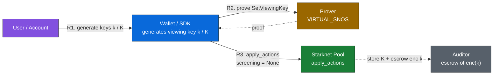
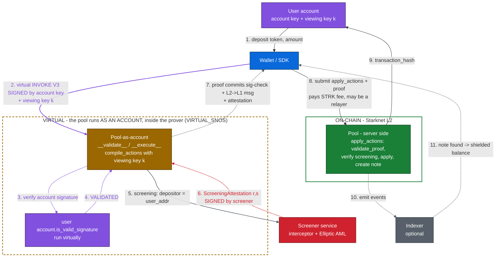

## Want to test STRK20 tokens from a backend (so, without any wallet)? 
Why not — but to access the official pools on Mainnet/Testnet, you must reach a StarkWare service that provides both the proofs and the SCREENING signatures (anti-money-laundering, AML). The catch: to this day, only Ready and Xverse have whitelisted IPs, so they're the only ones able to shield (deposit) tokens.

So, to run tests without a wallet, we'll use the unofficial Testnet pool (which lets you generate the screening signature yourself): address : `0xc7784a608eec3a1b933fe7f2630440188d61b3bbe28b597c76a06fd3686353`, Screening private key: `0xcafebabe`. You'll also need a local prover; I use this server https://github.com/PhilippeR26/secure-voty/tree/main/proofServer (heads-up: it's heavy, especially the amount of RAM it needs), which is a wrapper around the snip36 tool (https://github.com/starknet-innovation/snip-36-prover-backend).

- If you want example code showing how it works at a low level, have a look at scripts 4 to 8.
- If you'd rather have simpler, higher-level code, use the Privacy SDK. Examples in `withSTRK20SDK` directory (with a README).

Discover, by using them, just how awesome STRK20 tokens are!

## How a shield works — infrastructure, ordering & signatures

A **shield** = depositing public ERC-20 tokens into the privacy pool, where they become an
encrypted note. Registration (`SetViewingKey`) is a one-time prerequisite, otherwise the pool
answers `NOT_REGISTERED`.

**Step 1 — Registration** (once per user, immutable, no funds so no screening):

**Step 2 — Shield** (deposit public tokens, create an encrypted note). The two boxes are the
crux: the **dashed amber box = VIRTUAL world** (the pool executed *as an account* inside the
prover, where your signature is checked), the **solid green box = ON-CHAIN world** (Starknet L2,
`apply_actions`). Numbers = execution order. Line colours: **purple** = your account signature
(given, then *verified virtually*); **red dashed** = the screening signature; **grey** = returned
proof material / events; **solid black** = a plain request or on-chain submission:

### The pool is an account — your signature is verified *virtually*, inside the proof

This is the heart of the design (confirmed in `privacy.cairo` / `utils.cairo`):

- The pool contract is declared `#[starknet::contract(account)]` — it **is an account**, with its
  own `__validate__` and `__execute__`.
- That account side **never runs as a normal L2 transaction**: `assert_valid_os_call` requires a
  **zero caller (OS-originated)** and a V3 tx with **zero tip / zero resource bounds** (protocol
  fee `0`). It only executes **virtually, inside the prover** (VIRTUAL_SNOS) — the dashed box above.
- During the virtual `__execute__`, the pool-account compiles your actions with your **viewing
  key**, then calls **`assert_valid_signature(user_addr, tx_info)`**, which dispatches to **your
  own account contract**: `IAccountDispatcher(user_addr).is_valid_signature(tx_hash, signature)`.
  So your account signature over the *virtual* transaction is checked **by the pool acting as an
  account** — using whatever scheme your wallet implements (OZ / Argent / Braavos / Ledger /
  multisig). The virtual `__execute__` then emits the L2->L1 message `[class_hash, ...server_actions]`,
  and the **proof commits that this signature check passed and that exactly this message was produced**.
- On-chain, the pool's *other* face — `apply_actions` (the solid box) — only runs `validate_proof`
  (checks `program_variant == VIRTUAL_SNOS`, the `proof_facts`, and that the message hash matches),
  collects the STRK fee, and applies. It **never re-checks your account signature and never checks
  who submits** — authorization already lives in the proof. That is why the L2 tx carrying the proof
  (and paying the fee from `get_caller_address`) can be sent by **anyone, including a relayer**.

### Who signs what, and where each signature travels

| Signature / secret | Signed by | Circulation | Verified / used at |
|---|---|---|---|
| **Screening attestation** `(r,s)` | **Screener service** with `screener_private_key`, over the SNIP-12 rev-1 `DepositorValidation{depositor, issued_at}` message | Screener -> Prover (`additional_data.signature`) -> Wallet/SDK (packed as the `Option(ScreeningAttestation)` suffix, **not** proof-committed) -> Pool | Pool checks freshness + validity vs on-chain `screener_public_key`. **Deposits only** (fund-less actions carry `None`). |
| **ZK proof** + `proof_facts` | **Prover** (VIRTUAL_SNOS virtual execution) | Prover -> Wallet -> submitted with the tx -> Pool | Pool verifies it; this is what authenticates the whole private-state batch. |
| **Account private key** | **User's Starknet account** | Signs the **virtual** INVOKE consumed by the prover (*not* the on-chain tx) | Verified **virtually** by the pool-acting-as-account, which calls your account's `is_valid_signature`; the check is **committed in the proof**. The on-chain `apply_actions` never re-checks it. |
| **Viewing key `k`** (secret, not a signature) | Generated & held by the **Wallet** | Passed as calldata to the *virtual* `compile_actions` (off-chain) to derive nullifiers/notes; an ECDH-encrypted copy is escrowed on-chain at registration for the auditor | Never revealed on-chain in clear; only the auditor can decrypt the escrow. |

**Notes**
- The prover and the screener run **in parallel**; the official StarkWare service bundles both in a
  single JSON-RPC response (proof + screening signature) — there is no signature-only endpoint.
- On the unofficial Testnet pool (see top of this README) **you** hold the screener key
  (`0xcafebabe`), so you sign the `ScreeningAttestation` yourself and can shield without a wallet.
- **Two keys, both consumed *virtually* (neither is checked by the on-chain tx).** The **viewing
  key `k`** feeds `compile_actions`; the **account key** signs the virtual INVOKE that the
  pool-account verifies via `is_valid_signature`. Both live inside the VIRTUAL_SNOS proof. The
  on-chain `apply_actions` checks only the proof — so the submitter/fee-payer can be a **relayer**
  distinct from the depositor.
- Facts above were read from a **local, slightly stale** copy of `privacy.cairo` / `utils.cairo`
  (`assert_valid_os_call`, `assert_valid_signature`, `validate_proof`). The deployed contract adds
  the `screening` parameter to `apply_actions` but keeps this caller/proof/signature logic.