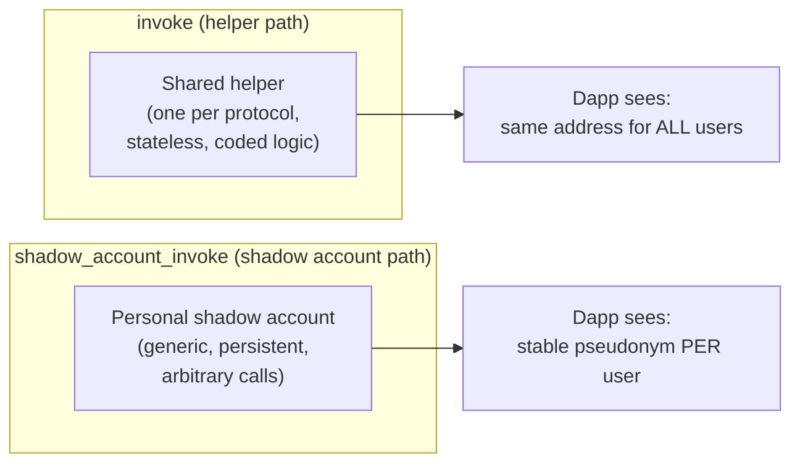
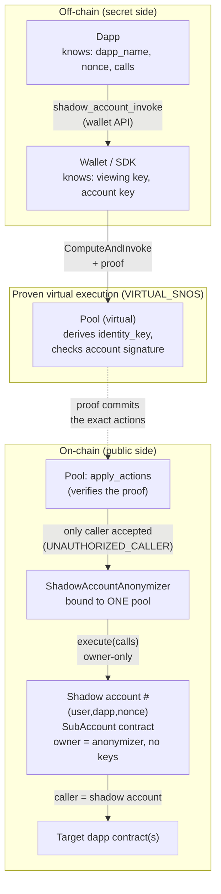
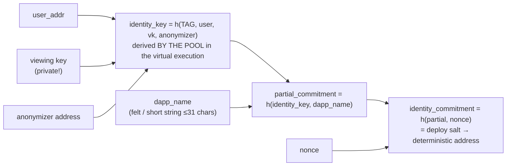
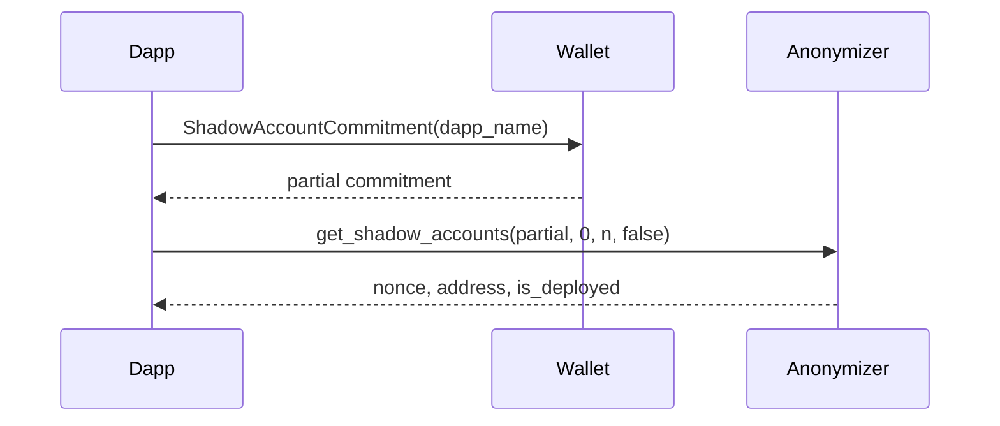
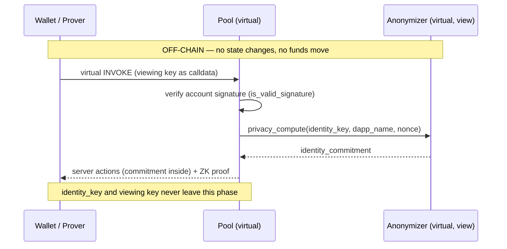
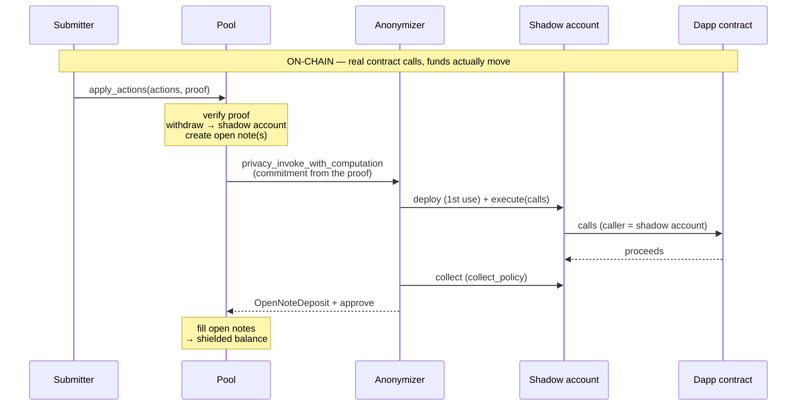
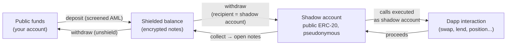

# STRK20 Shadow accounts — how the topic is structured, and how it works

*Audience: readers who already know STRK20 (pool, notes, open notes, actions, VIRTUAL_SNOS proofs).*
*Facts validated 2026-08-14 against `starknet-specs` PRs #400/#402, the `starkware-libs/starknet-privacy`
sources, the privacy SDK, and direct on-chain reads on Sepolia and Mainnet. Status markers reflect that date.*

> **⚠️ Renamed: "sub-account" → "shadow account".** Everything written before 2026-08 uses the old
> vocabulary. The rename went through the wallet API (types-js `0.10.4-beta.2`, get-starknet
> `6.0.4`), the privacy SDK (`0.14.3-RC.5`) and the Cairo anonymizer. It is **deliberately
> partial**: the deployed *account* contract is still `SubAccount`
> (`starkware_accounts::sub_account::SubAccount`, in `starkware-libs/starkware-starknet-utils` — a
> different repo). So `SubAccount` below is correct, not a leftover to fix. Renamed Cairo views
> **change their selector**, so new-name code cannot read a pre-rename anonymizer, and vice versa.

> **Terminology — "private / pseudonymous", not "anonymous".** STRK20 is a *privacy* protocol with
> compliance built in, not an anonymity system: (1) open-note amounts and shadow account balances are
> **public** — what is hidden is the *link* to you (pseudonymity / unlinkability toward public
> observers); (2) the auditor holds your escrowed viewing key, and that same key is an input of
> `identity_key` — so on a valid request the auditor can recompute all your shadow account commitments
> and de-pseudonymize them; (3) deposits are AML-screened. In this document, "unlinkable" always
> means "by public observers". ("Anonymizer" is kept as-is: it is StarkWare's contract name.)

---

## 1. What problem do shadow accounts solve?

The classic `invoke` action runs your dapp interaction through a **shared, stateless helper**
(Ekubo swap, Vesu lending): maximal unlinkability, but the dapp always sees the *same* caller address
for everybody, nothing persists between transactions, and every new protocol needs a dedicated,
audited helper contract.

A **shadow account** is the opposite trade-off: a **personal, persistent, pseudonymous contract**
that interacts with one dapp on your behalf. The dapp sees a stable address that can hold
positions, accumulate rewards, be whitelisted — yet no public observer can link that address back
to you (the auditor can — see the terminology note above).
One user derives **many** shadow accounts per dapp (one per `nonce`), so activity can be
compartmentalized (a whale splitting positions to avoid becoming a trackable identity).



Both paths occupy the transaction's **single invoke-phase slot** — they are mutually exclusive in
one STRK20 transaction.

---

## 2. The pieces, layer by layer

| Layer | Piece | Role |
|---|---|---|
| Wallet API spec | `shadow_account_invoke` action, `wallet_strk20ShadowAccountCommitment` method, `STRK20_DAPP_NAME`, `STRK20_COLLECT_POLICY` | What a dapp can ask (spec PRs #400 merged, #402 open) |
| Wallet / SDK | approval UI, viewing key, `ShadowAccountsBuilder` | Holds the secret (`identity_key` inputs), builds the `ComputeAndInvoke` client action, proves |
| Pool contract | `ComputeAndInvoke` client action (variant 9) | Derives `identity_key` **inside the proven virtual execution**, calls the anonymizer |
| `ShadowAccountAnonymizer` | `privacy_compute`, `privacy_invoke_with_computation`, `get_shadow_accounts` | Maps commitment → shadow account, deploys lazily, executes calls, collects proceeds |
| `SubAccount` (name unchanged) | `execute(calls)` (owner-only) | The pseudonymous executor. **No keys, not an account contract** |
| Target dapp | anything | Sees the shadow account as `caller` |



**The authorization chain is caller-address-based, not key-based.** `SubAccount.execute` obeys only
its owner (the anonymizer); the anonymizer obeys only its configured pool; the pool acts only on a
valid proof. There is **no shadow account private key** — nothing a wallet could hand out, and even
holding all the user's keys, a backend calling `execute` directly is rejected. This is deliberate:
a key-driven path would eventually leak the user↔shadow account link (gas, nonce, timing patterns).

Binding is **one-way**: an anonymizer is bound to one pool forever (constructor, no setter), but
the pool's `ComputeAndInvoke` accepts any target — one pool can serve many anonymizers.

---

## 3. Identity: the commitment math

Everything hangs on three nested hashes (Poseidon):



Consequences:

- **The dapp never sees a secret.** It supplies `dapp_name` + `nonce`; the wallet computes
  commitments locally (`wallet_strk20ShadowAccountCommitment`); the pool re-derives `identity_key`
  inside the proof, so the commitment is *authenticated* without revealing the user.
- **Partial commitment = discovery key.** Published once, it lets a dapp enumerate ALL the user's
  shadow accounts (`get_shadow_accounts(partial, start, end, until_undeployed)`, range ≤ 1024)
  without learning any nonce — including the **deterministic addresses of not-yet-deployed** shadow
  accounts. The 4th argument is new with the rename: `true` stops at the first undeployed nonce and
  returns only the contiguous deployed prefix, `false` resolves every nonce of the range.
- **`dapp_name` is scoping, not authentication.** No whitelist exists at any level (spec, wallet,
  contract) — any dapp can ask for any name, including another dapp's; the wallet's user-approval
  UI is the only gate.
- **Anonymizer address is inside `identity_key`** → the same (user, dapp, nonce) on a different
  anonymizer/pool yields completely disjoint, unlinkable shadow accounts. Corollary for operators:
  **redeploying an anonymizer moves every shadow account it served**, so upgrade in place if you
  need addresses to survive.

---

## 4. Lifecycle of a `shadow_account_invoke` transaction

There is **no "create shadow account" request**: creation is implicit — the anonymizer deploys the
`SubAccount` on first use (salt = commitment ⇒ the address was known beforehand).

**Phase A — discovery (views only, nothing sent):**



**Phase B — proving (VIRTUAL execution — nothing happens on-chain).** The dapp submits
`[withdraw → shadow account, transfer "OPEN", shadow_account_invoke]` via
`wallet_strk20InvokeTransaction`; after user approval, the prover **replays the pool contract
virtually** (the SNIP-36 / VIRTUAL_SNOS pattern). This virtual run is where every
**secret-dependent** step happens: the account signature check, and the derivation
`identity_key → privacy_compute → commitment`. Its output is a list of *server actions* (with the
opaque commitment baked in) plus the ZK proof:



**Phase C — settlement (everything below executes FOR REAL on-chain).** Anyone submits
`apply_actions(server_actions, proof)` — authorization lives in the proof, not in the caller. In
practice the submitter is a **paymaster forwarder** (AVNU `sponsored_private` mode, per the
official demo): it pays the gas and the pool's STRK fee from its own address, so the user's
account never appears in the block; the user reimburses it via a `withdraw` **fee action inserted
into the proven bundle** (paid from the shielded balance). The pool verifies the proof, then
actually executes the actions. Note that `privacy_compute` is **not re-run on-chain**: the
commitment travels inside the proven server action, so on-chain observers see only an opaque felt
— never `identity_key`:



The three actions of the canonical bundle (same shape as a helper swap, one atomic proof):

1. `withdraw` — funds the shadow account **from the shielded balance** (recipient = its precomputed
   address). Publicly unlinkable, because the funds visibly come from the pool, not from you.
2. `transfer` with `amount: "OPEN"` — one open note per expected output token.
3. `shadow_account_invoke { dapp_name, nonce, calls, collect_policy }` — the calls, executed *as*
   the shadow account. The anonymizer automatically receives **all** open notes of the transaction
   (no `${openNoteIds[N]}` placeholders on this path).

**`collect_policy`** decides how much of the shadow account's balance each settled note collects:
`all` (entire balance), `diff` (only what this interaction gained), `exact` (a given amount).
Constraints enforced by the anonymizer: collected amount > 0 (`ZERO_BALANCE`), at most **one open
note per token**, `NEGATIVE_DIFF` / `INSUFFICIENT_BALANCE` on policy violations.

---

## 5. The funding & privacy model — "an execution airlock, not shielded storage"

Funds sitting on a shadow account are **plain public ERC-20** — balances visible to all. What is
protected is the *link* between the address and you.



Rules of thumb:

- **You cannot shield directly into a shadow account**: `deposit` is always-to-self into the pool.
  The only unlinkable funding path is a pool `withdraw` to the shadow account's address.
- Balances **persist across interactions** (that's why `diff` exists) — funding and invoking can be
  separate transactions.
- Anyone *can* send tokens directly to a shadow account address, but a public transfer from your
  account links you to it — anti-pattern.
- `deposit` + `withdraw` + `shadow_account_invoke` in ONE tx is phase-legal but trivially links
  depositor ↔ shadow account (same amounts, same tx). Whether wallets reject this as `PRIVACY_LEAK`
  is not specified.
- Shadow account flows involve **no deposit action** → no AML screening needed; they even work on
  pools where deposits are screening-blocked. This is what
  [9.strk20ShadowAccountSweep.ts](../9.strk20ShadowAccountSweep.ts) demonstrates end-to-end:
  **validated on Sepolia 2026-08-14** against the post-rename anonymizer (`apply_actions` tx
  `0x64051a7eafeaa7bcf2ee2c1fe9c0756b3f81c5675032b2badd48f1d8fd8c7f9`). A public 1 STRK transfer to
  the shadow account, then ONE proof carrying `CreateOpenNote` + `ComputeAndInvoke(collect All)` with
  `screening: None`, moved it into the shielded balance — **3 server actions** (WriteOnce +
  EmitOpenNoteCreated + InvokeWithComputation), the shadow account deployed lazily on the way.

---

## 6. Helper vs shadow account — choosing a path

| | `invoke` (helper) | `shadow_account_invoke` |
|---|---|---|
| Contract to write | One audited helper per protocol | None (generic infra) |
| Caller seen by dapp | Shared helper address | User's stable pseudonym |
| State between txs | None (must zero out) | Balance/positions persist |
| Payload | Raw felts + `${…}` placeholders | Structured `calls` (any contract/entrypoint) |
| Open-note matching | Wallet pre-checks count (PR #395) | No wallet pre-check; contract enforces |
| Privacy profile | Maximal, ephemeral | Durable pseudonym, compartmented by nonces |
| Best for | Atomic round-trips (swap, lend-in-one-tx) | Held positions, rewards/points, dapp recognizing a user via commitment |

⚠️ **Naming trap:** in the `starknet-privacy` repo, `ekubo_swap_anonymizer` and
`vesu_lending_anonymizer` are *helpers* (the left column — "anonymizer" is the family name for
invoke-phase contracts). Only `shadow_account_anonymizer` implements shadow accounts, and it is
fully dapp-agnostic.

---

## 7. Status & gotchas (as of 2026-08-14)

- **Spec:** PR #400 (action + method + `STRK20_DAPP_NAME`) merged 2026-07-15. PR #402
  (`collect_policy`, **required** field — breaking) still open. The method is
  `wallet_strk20ShadowAccountCommitment`.
- **Deployed and verified on-chain (2026-08-14, direct reads).** The official
  `ShadowAccountAnonymizer` exists on both networks, at the **same class hash**
  `0x7ffaf4f427c8de0ca35d32d44d97a31da3c24641e32b72f340660d5b9e7f5e6`:

  | Network | Anonymizer | Bound pool | `get_shadow_account_class_hash()` |
  |---|---|---|---|
  | Mainnet | `0x04f33230dc57855c6e7eabe66dfa0fde82c5458fd0e54827cdb7cb4c474888a7` | `0x40337b1a…` | `0x346e143e…` |
  | Sepolia | `0x010a2285310c107c731d997afc147afb7495daff6397c2d242133d9fe8d9b147` | `0x254a6b29…` | `0x346e143e…` |

  Both expose `get_shadow_accounts` and no longer expose `get_sub_accounts`. **Both were upgraded
  in place** — the addresses did not move, the class behind them did.
- **⚠️ The rename also renamed TWO STORAGE VARIABLES — upgrading needs an EIC.** In Cairo a storage
  slot is `sn_keccak(name)`, so a renamed variable is a *different slot*, and replacing a class
  never touches storage. Both had to be migrated:

  | Pre-rename | Post-rename | Holds |
  |---|---|---|
  | `sub_account_class_hash` | `shadow_account_class_hash` | the class to deploy shadow accounts with |
  | `sub_accounts` | `shadow_accounts` | the **registry** `IdentityCommitment → deployed address` |

  An **EIC (External Initializer Contract)** is the `Replaceability` component's migration hook: a
  class — never deployed, never installed — that `replace_to` **library-calls** into the target, so
  its writes land in the target's storage. It is carried by the upgrade payload itself:
  `ImplementationData { impl_hash, eic_data: Option<EICData{eic_hash, eic_init_data}>, final }`.
  StarkWare shipped one EIC per variable (`packages/shadow_account_anonymizer/src/`):
  `ShadowAccountClassHashEIC` writes the class hash passed in `eic_init_data[0]`, and
  `ShadowAccountsMigrationEIC` (no init data) copies every `sub_accounts` entry into
  `shadow_accounts`. Each EIC declares only the *slice* of storage it touches, with names matching
  the target exactly — that is what makes the slots line up.

  **Verified on-chain, official Sepolia anonymizer** — two upgrades to the *same* implementation
  class, one per EIC:

  | Block | Event | EIC class | `eic_init_data` |
  |---|---|---|---|
  | 13352140 / 13352147 | Added / Replaced | `0x176565abbc374bd63ce98316847233b8c89618b99e223443fce9280cd46ab9c` | `[0x346e143e…]` |
  | 13352221 / 13352228 | Added / Replaced | `0x4688908018ec959f0605094ba5eb3384b7ef2fcd428deee2f2b3137b044a8fd` | *(empty)* |

  Raw storage across the first boundary shows the whole mechanism in one block — class switched and
  new slot written atomically, old slot left behind:

  ```
  blk 13352146: class=0x71118cb6…  sub_account_class_hash=0x956ddc41…  shadow_account_class_hash=0x0
  blk 13352147: class=0x7ffaf4f4…  sub_account_class_hash=0x956ddc41…  shadow_account_class_hash=0x346e143e…
  ```

  ⚠️ A bare `replace_to` (`eic_data: None`) would leave `shadow_account_class_hash = 0` **and an
  empty registry** — already-deployed shadow accounts would become invisible and the anonymizer
  would try to redeploy them at occupied addresses. ⚠️ Note also that changing the class hash is
  **not retroactive**: shadow accounts deployed before the swap keep their old code; only later
  ones use the new class.

  For a self-deployed instance with no registry worth preserving, redeploying is simpler — see
  [9.init.deployAnonymizer.ts](../9.init.deployAnonymizer.ts), which does exactly that and explains
  the trade-off (new address ⇒ new `identity_key` ⇒ shadow accounts move).
- **Privacy SDK:** shadow accounts shipped in `0.14.3-rc.4` and were **renamed in `0.14.3-RC.5`**:
  `build().shadowAccounts(dappName)` → `ShadowAccountsBuilder` (`partialCommitment()` /
  `commitment(nonce)` / `invoke(nonce, {calls, collectPolicy})`), config key
  `shadowAccountAnonymizerAddress`, ABI export `ShadowAccountAnonymizerABI`. `identify()` /
  `deployed()` are still declared but not implemented — use the `get_shadow_accounts` view.
- **Two unrelated breaking changes in that same `0.14.3-RC.5`**, easy to miss: node-provider fields
  are now named `node`, not `provider` (`builder.simulate({ node })`); and
  `SimplePrivateTransfers.withdraw(token, recipient, amount)` now leaves the change with the
  **sender** instead of the withdrawal recipient (`withdraw(…, All)` unchanged).
- **✅ SDK ↔ contract skew resolved** in privacy SDK `0.14.3-rc.4`: earlier versions generated an
  anonymizer ABI whose `OpenNote` lacked `collect_policy`, producing calldata the anonymizer
  rejects. Any bundle vendored before 2026-07-22 must be rebuilt — the copy under
  [withSTRK20SDK/](../withSTRK20SDK/) predates both that fix and the rename.
- **Wallet UX** (how Ready X / Xverse surface per-dapp approval and nonce management): nothing
  public yet.
