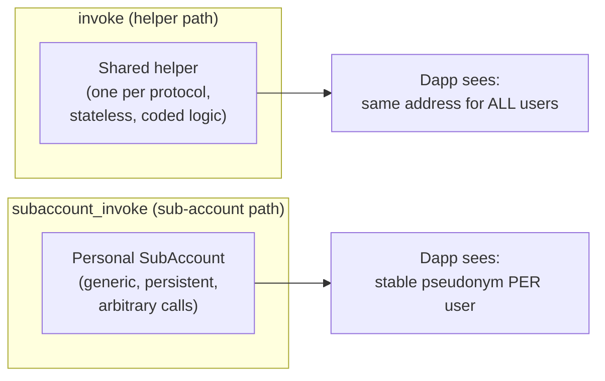
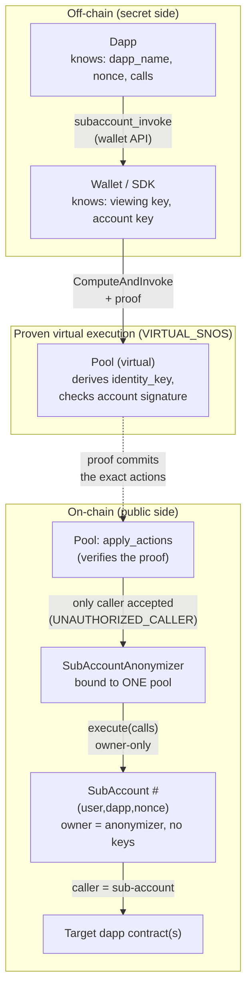
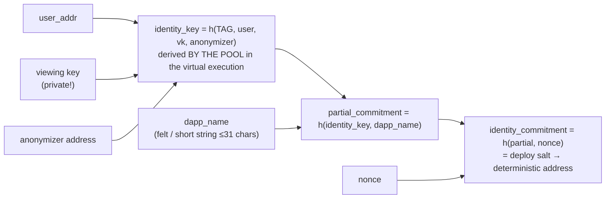
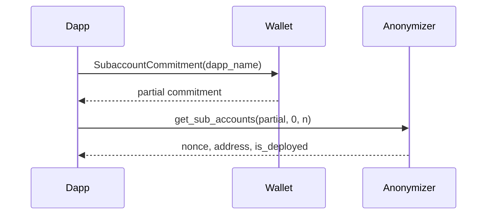
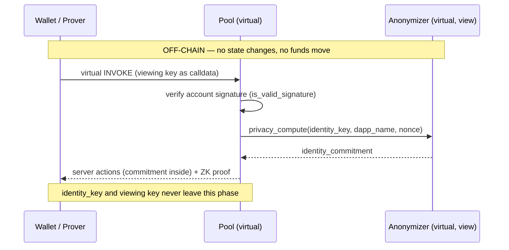
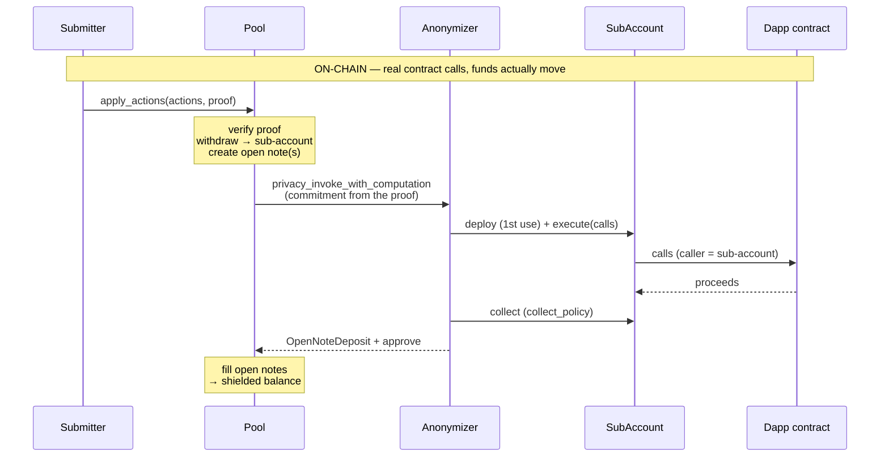
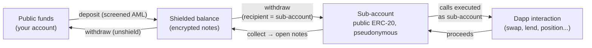

# STRK20 Sub-accounts — how the topic is structured, and how it works

*Audience: readers who already know STRK20 (pool, notes, open notes, actions, VIRTUAL_SNOS proofs).*
*Facts validated 2026-07-16 against `starknet-specs` PRs #400/#402, the `starkware-libs/starknet-privacy`
sources, and the SDK on `main`. Status markers reflect that date.*

> **Terminology — "private / pseudonymous", not "anonymous".** STRK20 is a *privacy* protocol with
> compliance built in, not an anonymity system: (1) open-note amounts and sub-account balances are
> **public** — what is hidden is the *link* to you (pseudonymity / unlinkability toward public
> observers); (2) the auditor holds your escrowed viewing key, and that same key is an input of
> `identity_key` — so on a valid request the auditor can recompute all your sub-account commitments
> and de-pseudonymize them; (3) deposits are AML-screened. In this document, "unlinkable" always
> means "by public observers". ("Anonymizer" is kept as-is: it is StarkWare's contract name.)

---

## 1. What problem do sub-accounts solve?

The classic `invoke` action runs your dapp interaction through a **shared, stateless helper**
(Ekubo swap, Vesu lending): maximal unlinkability, but the dapp always sees the *same* caller address
for everybody, nothing persists between transactions, and every new protocol needs a dedicated,
audited helper contract.

A **sub-account** is the opposite trade-off: a **personal, persistent, pseudonymous contract**
that interacts with one dapp on your behalf. The dapp sees a stable address that can hold
positions, accumulate rewards, be whitelisted — yet no public observer can link that address back
to you (the auditor can — see the terminology note above).
One user derives **many** sub-accounts per dapp (one per `nonce`), so activity can be
compartmentalized (a whale splitting positions to avoid becoming a trackable identity).

Both paths occupy the transaction's **single invoke-phase slot** — they are mutually exclusive in
one STRK20 transaction.

---

## 2. The pieces, layer by layer

| Layer | Piece | Role |
|---|---|---|
| Wallet API spec | `subaccount_invoke` action, `wallet_strk20SubaccountCommitment` method, `STRK20_DAPP_NAME`, `STRK20_COLLECT_POLICY` | What a dapp can ask (spec PRs #400 merged, #402 open) |
| Wallet / SDK | approval UI, viewing key, `SubAccountsBuilder` | Holds the secret (`identity_key` inputs), builds the `ComputeAndInvoke` client action, proves |
| Pool contract | `ComputeAndInvoke` client action (variant 9) | Derives `identity_key` **inside the proven virtual execution**, calls the anonymizer |
| `SubAccountAnonymizer` | `privacy_compute`, `privacy_invoke_with_computation`, `get_sub_accounts` | Maps commitment → sub-account, deploys lazily, executes calls, collects proceeds |
| `SubAccount` | `execute(calls)` (owner-only) | The pseudonymous executor. **No keys, not an account contract** |
| Target dapp | anything | Sees the sub-account as `caller` |

**The authorization chain is caller-address-based, not key-based.** `SubAccount.execute` obeys only
its owner (the anonymizer); the anonymizer obeys only its configured pool; the pool acts only on a
valid proof. There is **no sub-account private key** — nothing a wallet could hand out, and even
holding all the user's keys, a backend calling `execute` directly is rejected. This is deliberate:
a key-driven path would eventually leak the user↔sub-account link (gas, nonce, timing patterns).

Binding is **one-way**: an anonymizer is bound to one pool forever (constructor, no setter), but
the pool's `ComputeAndInvoke` accepts any target — one pool can serve many anonymizers.

---

## 3. Identity: the commitment math

Everything hangs on three nested hashes (Poseidon):

Consequences:

- **The dapp never sees a secret.** It supplies `dapp_name` + `nonce`; the wallet computes
  commitments locally (`wallet_strk20SubaccountCommitment`); the pool re-derives `identity_key`
  inside the proof, so the commitment is *authenticated* without revealing the user.
- **Partial commitment = discovery key.** Published once, it lets a dapp enumerate ALL the user's
  sub-accounts (`get_sub_accounts(partial, start, end)`, range ≤ 1024) without learning any nonce
  — including the **deterministic addresses of not-yet-deployed** sub-accounts.
- **`dapp_name` is scoping, not authentication.** No whitelist exists at any level (spec, wallet,
  contract) — any dapp can ask for any name, including another dapp's; the wallet's user-approval
  UI is the only gate.
- **Anonymizer address is inside `identity_key`** → the same (user, dapp, nonce) on a different
  anonymizer/pool yields completely disjoint, unlinkable sub-accounts.

---

## 4. Lifecycle of a `subaccount_invoke` transaction

There is **no "create sub-account" request**: creation is implicit — the anonymizer deploys the
`SubAccount` on first use (salt = commitment ⇒ the address was known beforehand).

**Phase A — discovery (views only, nothing sent):**

**Phase B — proving (VIRTUAL execution — nothing happens on-chain).** The dapp submits
`[withdraw → sub-account, transfer "OPEN", subaccount_invoke]` via
`wallet_strk20InvokeTransaction`; after user approval, the prover **replays the pool contract
virtually** (the SNIP-36 / VIRTUAL_SNOS pattern). This virtual run is where every
**secret-dependent** step happens: the account signature check, and the derivation
`identity_key → privacy_compute → commitment`. Its output is a list of *server actions* (with the
opaque commitment baked in) plus the ZK proof:

**Phase C — settlement (everything below executes FOR REAL on-chain).** Anyone submits
`apply_actions(server_actions, proof)` — authorization lives in the proof, not in the caller. In
practice the submitter is a **paymaster forwarder** (AVNU `sponsored_private` mode, per the
official demo): it pays the gas and the pool's STRK fee from its own address, so the user's
account never appears in the block; the user reimburses it via a `withdraw` **fee action inserted
into the proven bundle** (paid from the shielded balance). The pool verifies the proof, then
actually executes the actions. Note that `privacy_compute` is **not re-run on-chain**: the
commitment travels inside the proven server action, so on-chain observers see only an opaque felt
— never `identity_key`:

The three actions of the canonical bundle (same shape as a helper swap, one atomic proof):

1. `withdraw` — funds the sub-account **from the shielded balance** (recipient = its precomputed
   address). Publicly unlinkable, because the funds visibly come from the pool, not from you.
2. `transfer` with `amount: "OPEN"` — one open note per expected output token.
3. `subaccount_invoke { dapp_name, nonce, calls, collect_policy }` — the calls, executed *as* the
   sub-account. The anonymizer automatically receives **all** open notes of the transaction (no
   `${openNoteIds[N]}` placeholders on this path).

**`collect_policy`** decides how much of the sub-account's balance each settled note collects:
`all` (entire balance), `diff` (only what this interaction gained), `exact` (a given amount).
Constraints enforced by the anonymizer: collected amount > 0 (`ZERO_BALANCE`), at most **one open
note per token**, `NEGATIVE_DIFF` / `INSUFFICIENT_BALANCE` on policy violations.

---

## 5. The funding & privacy model — "an execution airlock, not shielded storage"

Funds sitting on a sub-account are **plain public ERC-20** — balances visible to all. What is
protected is the *link* between the address and you.

Rules of thumb:

- **You cannot shield directly into a sub-account**: `deposit` is always-to-self into the pool.
  The only unlinkable funding path is a pool `withdraw` to the sub-account's address.
- Balances **persist across interactions** (that's why `diff` exists) — funding and invoking can be
  separate transactions.
- Anyone *can* send tokens directly to a sub-account address, but a public transfer from your
  account links you to it — anti-pattern.
- `deposit` + `withdraw` + `subaccount_invoke` in ONE tx is phase-legal but trivially links
  depositor ↔ sub-account (same amounts, same tx). Whether wallets reject this as `PRIVACY_LEAK`
  is not specified.
- Sub-account flows involve **no deposit action** → no AML screening needed; they even work on
  pools where deposits are screening-blocked.

---

## 6. Helper vs sub-account — choosing a path

| | `invoke` (helper) | `subaccount_invoke` |
|---|---|---|
| Contract to write | One audited helper per protocol | None (generic infra) |
| Caller seen by dapp | Shared helper address | User's stable pseudonym |
| State between txs | None (must zero out) | Balance/positions persist |
| Payload | Raw felts + `${…}` placeholders | Structured `calls` (any contract/entrypoint) |
| Open-note matching | Wallet pre-checks count (PR #395) | No wallet pre-check; contract enforces |
| Privacy profile | Maximal, ephemeral | Durable pseudonym, compartmented by nonces |
| Best for | Atomic round-trips (swap, lend-in-one-tx) | Held positions, rewards/points, dapp recognizing a user via commitment |

⚠️ **Naming trap:** in the `starknet-privacy` repo, `ekubo_swap_anonymizer` and
`vesu_lending_anonymizer` are *helpers* (the left column — "anonymizer" is the family name for
invoke-phase contracts). Only `sub_account_anonymizer` implements sub-accounts, and it is fully
dapp-agnostic.

---

## 7. Status & gotchas (as of 2026-07-16)

- **Spec:** PR #400 (action + method + `STRK20_DAPP_NAME`) merged 2026-07-15. PR #402
  (`collect_policy`, **required** field — breaking) still open. The method is
  `wallet_strk20SubaccountCommitment` (the PR body's `Get…` name was dropped in review).
- **Nothing deployed yet:** no official `SubAccountAnonymizer` on Mainnet or Sepolia; consequently
  the `SubAccount` class is declared nowhere (locally compiled class hashes won't match a future
  official declaration anyway — toolchain/profile/commit all shift the Sierra). When it ships, read
  `get_sub_account_class_hash()` on the official anonymizer.
- **SDK:** sub-account support (`build().subaccounts(dappName)` → `partialCommitment() /
  commitment(nonce) / invoke(nonce, {calls})`) is in the CHANGELOG "Unreleased"; requires
  `subAccountAnonymizerAddress` in the `createPrivateTransfers` config. `identify()` / `deployed()`
  declared but not implemented.
- **⚠️ SDK ↔ contract skew:** the SDK's generated anonymizer ABI still compiles `OpenNote` without
  `collect_policy`, while the contract on `main` requires it → Serde mismatch if you pair current
  SDK with an anonymizer built from `main`. Patch the ABI (policy `All` serializes as one felt `0`)
  or wait for the sync expected with PR #402's rollout.
- **Wallet UX** (how Ready X / Xverse will surface per-dapp approval and nonce management): nothing
  public yet.
